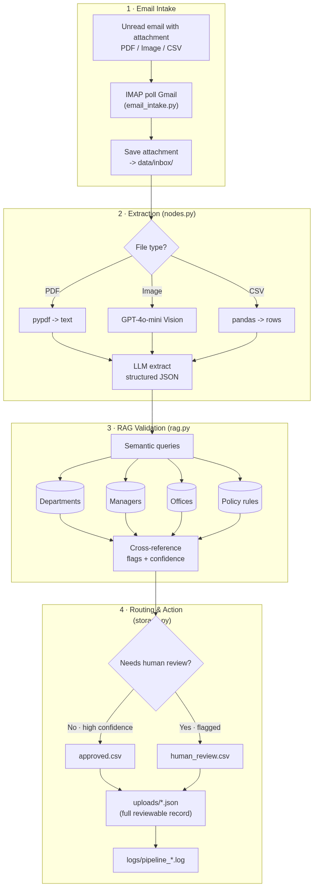

# AI Agent


Built for the **Agentic AI Engineer** test task (Flat Rock Technology). 

---

## Architecture



flowchart LR
    A[Email + attachment<br/>PDF / Image / CSV] --> B[Email Intake<br/>Gmail IMAP]
    B --> C[Extraction<br/>PDF / Vision / CSV -> JSON]
    C --> D[RAG Validation<br/>ChromaDB knowledge base]
    D --> E{Confident &<br/>compliant?}
    E -->|Yes| F[(approved.csv)]
    E -->|No| G[(human_review.csv)]
    F --> H[uploads/*.json + logs/]
    G --> H
```

---

## What it does (end to end)

1. **Email intake** — picks up an unread email with an attachment from a **live Gmail inbox (IMAP)**.
2. **Extraction** — reads the attachment and extracts structured JSON. Handles three formats:
   - **PDF** → text via `pypdf`
   - **Image** (scanned form) → `gpt-4o-mini` **vision**
   - **CSV** (bulk list) → `pandas`, one record per row
3. **RAG validation** — queries a **ChromaDB** vector store to cross-reference the extraction against company knowledge (departments, managers, offices, policy).
4. **Routing & action** — high-confidence, compliant records are **auto-approved and stored**; anything with missing fields, an unknown value, or a policy conflict is **flagged for human review** with reasons.
5. **Records & logging** — every processed document is saved as a reviewable JSON file and every run is logged with timestamps.

---

## Extraction schema

Each document is extracted into this structure:

```json
{
  "employee_name": "John Smith",
  "email": "john.smith@flatrock.com",
  "department": "Engineering",
  "manager": "Sarah Brown",
  "office": "Colombo",
  "start_date": "2026-08-01"
}
```

Missing values are returned as empty strings (never hallucinated), so downstream validation can flag them.

---

## RAG: how the knowledge base adds real value

A small set of company documents is loaded into a **ChromaDB** vector store (`build_kb.py`). The agent then queries it to **validate**, not just extract:

| Knowledge file | Validates |
|---|---|
| `knowledge_base/departments.md` | Is the department real? Does the manager match the department? |
| `knowledge_base/managers.md` | Is this a known manager at all? |
| `knowledge_base/offices.md` | Is the office an approved location? |
| `knowledge_base/onboarding_policy.md` | Email domain, required fields, contract rules, etc. |


Each record also gets a **confidence score** = the share of validation checks that passed.

---

## Routing logic

| Outcome | Condition | Stored in |
|---|---|---|
| **Approved** | All checks pass | `outputs/approved.csv` |
| **Human review** | Missing field, unknown dept/manager/office, policy violation, or unreadable file | `outputs/human_review.csv` |

Every processed record (both outcomes) is also written to `uploads/<file>__<name>.json`:

```json
{
    "metadata": {
        "file_name": "onboarding_batch.csv",
        "sender": "hr@partnercompany.com",
        "processed_at": "2026-07-09T10:30:15+00:00",
        "document_type": "Employee Onboarding"
    },
    "employee_data": { "...": "..." },
    "validation": { "department_valid": true, "manager_valid": false, "office_valid": true },
    "flags": ["Manager 'Sarah Brown' does not manage Finance (directory shows David Lee)"],
    "status": "Human Review",
    "confidence": 0.83
}
```

---

## Handling things going wrong

- **Missing fields** → flagged and routed to human review
- **Unknown department / manager / office** → caught by RAG
- **Policy violations** (e.g. non-`@flatrock.com` email) → flagged
- **Corrupt / unreadable file** → caught by `try/except`, logged, and routed to review — the batch never crashes

---

## Tech stack

- **LLM:** OpenAI `gpt-4o-mini` (text + vision) via **LangChain**
- **Vector store / RAG:** **ChromaDB** (local, persistent)
- **File parsing:** `pypdf` (PDF), OpenAI vision (images), `pandas` (CSV)
- **Email:** `imaplib` (live Gmail IMAP)
- **Language:** Python 3.12

---

## Project structure

```
Test_task/
├── src/
│   ├── config.py          # paths, env vars, thresholds
│   ├── logger.py          # timestamped logging to logs/
│   ├── prompts.py         # extraction prompt
│   ├── nodes.py           # file parsing + LLM extraction (PDF/image/CSV)
│   ├── build_kb.py        # loads knowledge base into ChromaDB
│   ├── rag.py             # RAG validation + confidence
│   ├── storage.py         # routing + CSV + JSON records
│   ├── main.py            # pipeline orchestrator (process files in data/)
│   ├── email_intake.py    # ENTRY POINT: email -> full pipeline
│   └── make_diagram.py    # renders docs/architecture.png
├── knowledge_base/        # RAG source documents
├── data/                  # sample attachments (PDF/image/CSV) + inbox/
├── outputs/               # approved.csv, human_review.csv
├── uploads/               # per-record JSON results
├── logs/                  # timestamped run logs
├── docs/architecture.mmd  # diagram source
├── requirements.txt
└── .env                   # secrets (not committed)
```

---

## Setup

1. **Create & activate a virtual environment**, then install dependencies:
   ```powershell
   pip install -r requirements.txt
   ```

2. **Create a `.env` file** in the project root (see `.env.example`):
   ```
   OPENAI_API_KEY=''
   OPENAI_MODEL=gpt-4o-mini

   # Only needed for live email mode:
   IMAP_HOST=imap.gmail.com
   IMAP_PORT=993
   IMAP_USER=youraddress@gmail.com
   IMAP_PASSWORD=your-gmail-app-password
   IMAP_FOLDER=INBOX
   IMAP_SUBJECT_FILTER=Onboarding
   ```

3. **Build the knowledge base** (once, or after editing `knowledge_base/`):
   ```powershell
   python src/build_kb.py
   ```

---

## How to run

**Full end-to-end (email intake → pipeline):**
```powershell
# Live Gmail: pick up unread emails with attachments
python src/email_intake.py
```

**Pipeline only (skip email, process files already in `data/`):**
```powershell
# all files in data/
python src/main.py

# a single file
python src/main.py data/employee_2.pdf
```

Results appear in `outputs/`, `uploads/`, and `logs/`.

---

## Example run

```
07/09/26 10:33:44 | INFO    | PROCESSING: data/inbox/employee_2.pdf
07/09/26 10:33:50 | INFO    |    employee_name  : John Smith
07/09/26 10:33:50 | INFO    |    department     : Engineering
07/09/26 10:33:50 | INFO    |    manager        : Sarah Brown
07/09/26 10:33:50 | INFO    | Decision: AUTO-APPROVE
07/09/26 10:33:50 | INFO    | Confidence: 1.0
07/09/26 10:33:50 | INFO    | Stored in : outputs/approved.csv
07/09/26 10:33:50 | INFO    | JSON      : uploads/employee_2__John_Smith.json
```

---

## Design notes

- **Plain Python orchestration** (not a heavy framework) keeps the pipeline readable and easy to follow: `extract → validate → route → store`.
- **RAG drives decisions**, it is not decoration — validation failures come directly from knowledge-base lookups.
- **Confidence is honest** — derived from concrete validation checks, not a guessed number.
- **Fail-safe** — a bad file is logged and sent to human review rather than crashing the run.
